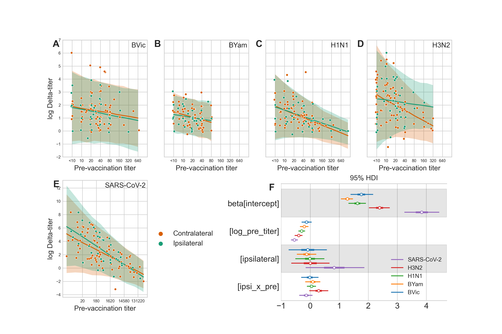

# flu-covid-coadministration

Data and code from:

> **Ipsilateral and contralateral coadministration of influenza and COVID-19 vaccines produce similar
antibody responses** _eBioMedicine_ 103, 105103 (2024) doi: [10.1016/j.ebiom.2024.105103](https://doi.org/10.1016/j.ebiom.2024.105103)

David Pattinson1, Peter Jester1, Chunyang Gu1, Lizheng Guan1, Tammy Armbrust
1, Joshua G. Petrie2, Jennifer P. King2, Huong Q. McLean2, Edward A. Belongia
2, Peter Halfmann1, Gabriele Neumann1, Yoshihiro Kawaoka1,3,4,*

1. Department of Pathobiological Sciences, School of Veterinary Medicine, University of
   Wisconsin-Madison, Madison, WI 53706, USA
2. Marshfield Clinic Research Institute, Marshfield, WI 54449, USA
3. Division of Virology, Department of Microbiology and Immunology, Institute of Medical
   Science, University of Tokyo, Tokyo 108-0071, Japan
4. Department of Special Pathogens, International Research Center for Infectious
   Diseases, Institute of Medical Science, University of Tokyo, Tokyo 108-0071, Japan

 _Fig. 1_: Vaccine responses after ipsilateral (n = 35) and contralateral (n = 81)
coadministration of COVID-19 and influenza vaccines. See
[study](https://doi.org/10.1016/j.ebiom.2024.105103) for details.

# Repository contents

- [data.csv](data.csv) Contains long format data. Columns are:
  - `experiment`: `1` or `2` for the first or second replicate.
  - `virus`: `BVic`, `BYam`, `H1N1`, `H3N2` or `SARS-CoV-2`
  - `pre_sample`: This individual's pre-vaccination sample*.
  - `post_sample`: This individual's post-vaccination sample name*.
  - `log_pre_titer`: Pre-vaccination titer on the log scale.
  - `log_post_titer`: Post-vaccination titer on the log scale.
  - `log_delta_titer`: `log_post_titer` minus `log_delta_titer`
  - `sites`: `Ipsilateral` or `Contralateral` indicating whether this individual received
    their flu and COVID vaccines ipsilaterally or contralaterally.
- [analysis.ipynb](analysis.ipynb) is an IPython notebook containing code to rerun the
  Bayesian model used in the study, and to recreate [Figure 1](fig1.pdf) (the legend and
  tick labels were manually edited for the manuscript version.)
- [effects.csv](effects.csv) is generated by the IPython and contains summaries of
  posterior distributions of model effects.
- [requirements.txt](requirements.txt) contains python package versions used in this
  analysis. Install them (in a new virtual environment) via `pip install -r
  requirements.txt` 

*sample names were hashed for anonymity.